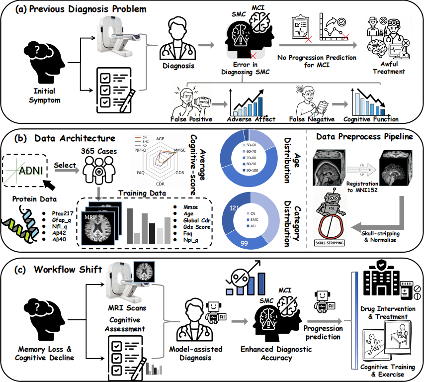
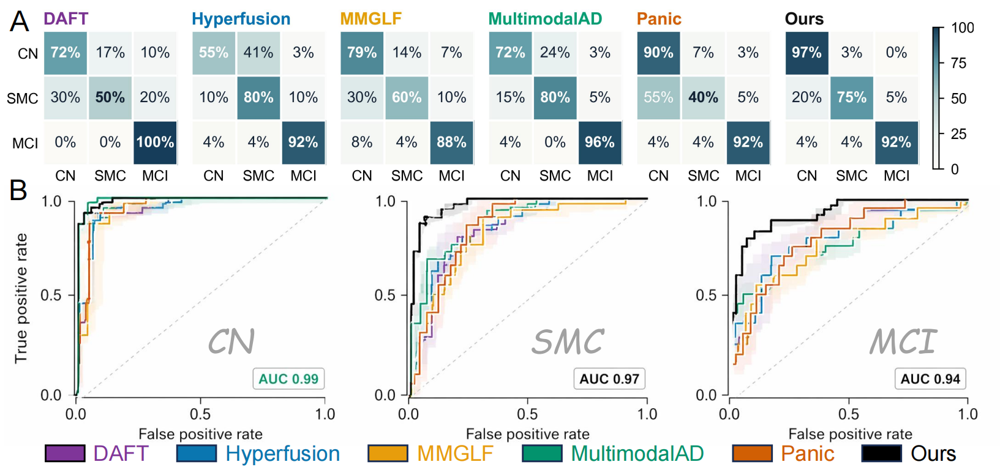

# DT-GML

## ✨ Overall Study Overview

<p align="center">
  
</p>

---

## 💡 Primary Contribution
- **🧬 Dynamic multimodal framework:** We propose **DT-GML** for multimodal early Alzheimer's disease analysis using structural MRI and clinical scale information.

- **🩺 SMC-oriented diagnosis:** DT-GML focuses on **subjective memory complaints (SMC)**, an early and clinically important stage that has received limited attention in previous AD studies.

- **🔄 Two-stage clinical pipeline:** DT-GML jointly supports early cognitive state diagnosis and MCI-to-AD progression prediction within a unified framework.

- **🔍 Interpretable prediction:** Plasma biomarker correlation and brain-region visualization demonstrate the biological plausibility of model predictions.

- **💻 Open-source release:** We provide source code and implementation details to support reproducibility and further research.
<p align="center">
  
</p>

## 🧠 Interpretability

<p align="center">
  
</p>

<p align="center">
  
</p>


---

## 🤖 Proposed Method

<h3>Diagnostic Model</h3>

<p>
The diagnostic model jointly leverages MRI and tabular clinical information for early Alzheimer's disease assisted diagnosis. It introduces an early cross modal knowledge transfer mechanism and a similarity guided dynamic modulation strategy to enhance multimodal feature interaction and improve classification stability across CN, SMC, and MCI stages.
</p>

<p align="center">
  
</p>
<p align="center">
  
</p>

<h3>Progression Prediction Model</h3>

<p>
The progression prediction model estimates disease conversion risk by integrating MRI representations with clinical variables. A Transformer based multimodal modeling framework is combined with prototype learning to reduce ambiguous class boundaries and improve the generalization of short term progression prediction.
</p>

<p align="center">
  
</p>

---

## 📦 Environment
- Python <3.12.4>
- PyTorch >= <2.4.0>

"Quickstart: Create an Environment (Example)"：
```bash
conda create -n <env_name> python=3.9 -y
conda activate <env_name>
pip install -r requirements.txt
```

---

## 🏋️‍♂️ Train & Test

To train and evaluate the model, simply run:

```bash
python main.py
```

---

## 📊 Results
<h2 style="color:blue;">Overall Evaluation Metrics of Diagnosis</h2>

<table>
  <tr>
    <th>Models</th>
    <th>Acc ↑</th>
    <th>F1 ↑</th>
    <th>Sen ↑</th>
    <th>Prec ↑</th>
    <th>MCC ↑</th>
    <th>Kappa ↑</th>
  </tr>

  <tr>
    <td>DAFT</td>
    <td>67.80 ± 13.84</td>
    <td>66.84 ± 12.55</td>
    <td>70.37 ± 5.73</td>
    <td>64.71 ± 17.41</td>
    <td>53.11 ± 17.46</td>
    <td>51.45 ± 19.94</td>
  </tr>

  <tr>
    <td>MMGLF</td>
    <td>73.76 ± 5.43</td>
    <td>70.98 ± 7.11</td>
    <td>61.62 ± 34.98</td>
    <td>69.12 ± 10.89</td>
    <td>61.32 ± 7.66</td>
    <td>59.30 ± 8.91</td>
  </tr>

  <tr>
    <td>PANIC</td>
    <td><u>79.44 ± 4.73</u></td>
    <td><u>76.84 ± 5.93</u></td>
    <td><u>81.10 ± 5.09</u></td>
    <td><u>77.88 ± 5.84</u></td>
    <td><u>69.75 ± 6.42</u></td>
    <td><u>68.12 ± 7.70</u></td>
  </tr>

  <tr>
    <td>MultimodalAD</td>
    <td>70.53 ± 10.07</td>
    <td>72.33 ± 8.09</td>
    <td>76.60 ± 6.06</td>
    <td>69.54 ± 10.65</td>
    <td>60.37 ± 10.44</td>
    <td>56.83 ± 13.72</td>
  </tr>

  <tr>
    <td>Hyperfusion</td>
    <td>71.37 ± 4.23</td>
    <td>71.19 ± 3.96</td>
    <td>71.74 ± 4.88</td>
    <td>71.25 ± 4.63</td>
    <td>57.70 ± 6.71</td>
    <td>56.93 ± 6.31</td>
  </tr>

  <tr>
    <td><b>Ours</b></td>
    <td><b>84.86 ± 2.76</b></td>
    <td><b>83.46 ± 3.29</b></td>
    <td><b>85.29 ± 2.00</b></td>
    <td><b>84.07 ± 3.52</b></td>
    <td><b>77.38 ± 4.12</b></td>
    <td><b>76.77 ± 4.24</b></td>
  </tr>
</table>

<p>
  The best results are shown in <b>bold</b>.
</p>

<h2 style="color:blue;">Ablation Study</h2>

<p>
  Overall ablation study results of DT-GML on ADNI.
  The best results are shown in <b>bold</b>.
</p>

<table>
  <tr>
    <th rowspan="2">Models</th>
    <th colspan="6" style="text-align:center;">Overall Evaluation Metrics</th>
  </tr>
  <tr>
    <th>Acc ↑</th>
    <th>F1 ↑</th>
    <th>Sen ↑</th>
    <th>Prec ↑</th>
    <th>MCC ↑</th>
    <th>Kappa ↑</th>
  </tr>

  <tr>
    <td>w/o TAB</td>
    <td>56.49 ± 9.33</td>
    <td>55.33 ± 9.79</td>
    <td>50.19 ± 29.76</td>
    <td>53.70 ± 12.46</td>
    <td>34.63 ± 15.49</td>
    <td>33.00 ± 14.74</td>
  </tr>

  <tr>
    <td>w/o MRI</td>
    <td>50.27 ± 7.49</td>
    <td>46.76 ± 10.68</td>
    <td>23.75 ± 32.56</td>
    <td>40.79 ± 15.79</td>
    <td>28.49 ± 8.67</td>
    <td>20.67 ± 14.86</td>
  </tr>

  <tr>
    <td>Baseline</td>
    <td>52.43 ± 5.60</td>
    <td>50.66 ± 5.72</td>
    <td>60.46 ± 10.64</td>
    <td>49.42 ± 7.61</td>
    <td>29.65 ± 8.23</td>
    <td>26.37 ± 8.44</td>
  </tr>

  <tr>
    <td>w/o Sim-Guide</td>
    <td>78.65 ± 1.76</td>
    <td>76.58 ± 2.22</td>
    <td>79.50 ± 2.42</td>
    <td>76.58 ± 2.16</td>
    <td>68.19 ± 2.81</td>
    <td>67.12 ± 2.72</td>
  </tr>

  <tr>
    <td>w/o DyT</td>
    <td><u>79.46 ± 2.22</u></td>
    <td><u>77.51 ± 2.24</u></td>
    <td><u>81.27 ± 3.47</u></td>
    <td><u>78.09 ± 2.29</u></td>
    <td><u>69.47 ± 3.57</u></td>
    <td><u>68.38 ± 3.41</u></td>
  </tr>

  <tr>
    <td>w/o KT</td>
    <td>77.57 ± 2.05</td>
    <td>76.79 ± 2.87</td>
    <td>78.96 ± 3.48</td>
    <td>76.50 ± 2.12</td>
    <td>66.96 ± 3.82</td>
    <td>65.87 ± 3.25</td>
  </tr>

  <tr>
    <td><b>Ours</b></td>
    <td><b>84.86 ± 2.76</b></td>
    <td><b>83.46 ± 3.29</b></td>
    <td><b>85.29 ± 2.00</b></td>
    <td><b>84.07 ± 3.52</b></td>
    <td><b>77.38 ± 4.12</b></td>
    <td><b>76.77 ± 4.24</b></td>
  </tr>
</table>

<h2 style="color:blue;">Progression Prediction</h2>

<p>
  Comparison of DT-GML against models on the progression prediction task.
  The best results are shown in <b>bold</b>.
</p>

<table>
  <tr>
    <th rowspan="2">Models</th>
    <th rowspan="2">MRI</th>
    <th rowspan="2">TAB</th>
    <th colspan="6" style="text-align:center;">Short term Evaluation Metrics</th>
  </tr>
  <tr>
    <th>Acc ↑</th>
    <th>F1 ↑</th>
    <th>Sen ↑</th>
    <th>Prec ↑</th>
    <th>MCC ↑</th>
    <th>Kappa ↑</th>
  </tr>

  <tr>
    <td>CNN-TLSTM</td>
    <td>✓</td>
    <td>—</td>
    <td>71.15</td>
    <td>64.94</td>
    <td>63.00</td>
    <td>67.00</td>
    <td>39.20</td>
    <td>38.10</td>
  </tr>

  <tr>
    <td>Multi-ERMHA</td>
    <td>✓</td>
    <td>—</td>
    <td>71.15</td>
    <td>60.17</td>
    <td>56.00</td>
    <td>65.00</td>
    <td>30.10</td>
    <td>28.70</td>
  </tr>

  <tr>
    <td>Ours</td>
    <td>✓</td>
    <td>—</td>
    <td><u>82.75</u></td>
    <td><u>78.47</u></td>
    <td><u>77.00</u></td>
    <td><u>80.00</u></td>
    <td><u>61.20</u></td>
    <td><u>59.80</u></td>
  </tr>

  <tr>
    <td><b>Ours</b></td>
    <td>✓</td>
    <td>✓</td>
    <td><b>94.12</b></td>
    <td><b>92.50</b></td>
    <td><b>93.00</b></td>
    <td><b>92.00</b></td>
    <td><b>88.90</b></td>
    <td><b>87.60</b></td>
  </tr>
</table>


## Citation

```

```
